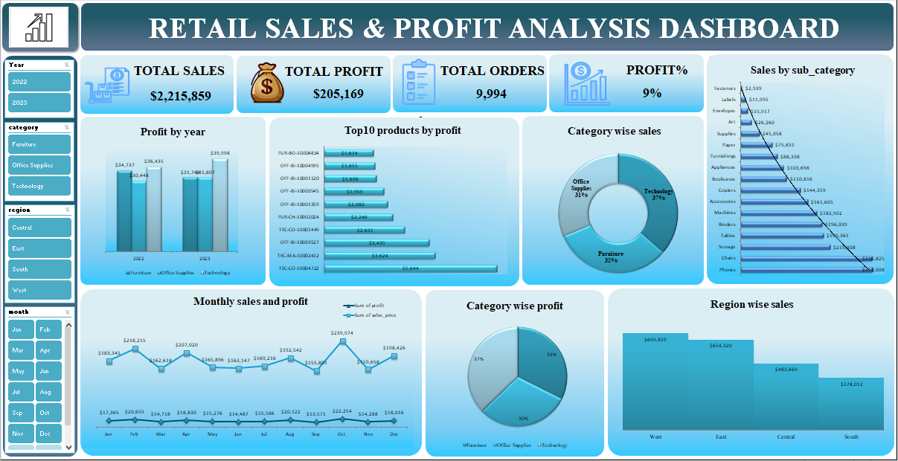

# Retail Sales & Profit Analysis Dashboard

## 📊 Overview
Developed an interactive retail sales and profit analysis dashboard using Microsoft Excel, leveraging Pivot Tables and slicers to analyze sales, profit, and performance trends.

## 🛠 Tools & Techniques
- Microsoft Excel
- Pivot Tables & Pivot Charts
- Slicers for dynamic filtering
- KPI Design
- Data Visualization & Dashboard Development

## 📌 Features
- KPI Cards (Total Sales, Profit, Orders, Profit %)
- Category-wise and region-wise analysis
- Monthly sales and profit trends
- Top 10 products by profit

## 📷 Dashboard Preview

